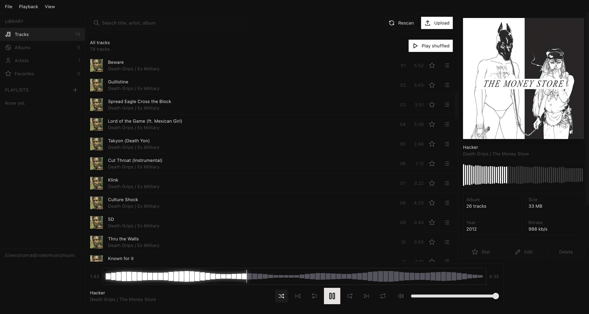

# music

A music player that serves your own folder of files. Point it at a directory,
open the page, and it reads the tags once and remembers what it read. Nothing
is uploaded anywhere, nothing phones home, and the files themselves are never
rewritten: a tag you fix here is a note the app keeps beside the file.



## Requirements

- [Bun](https://bun.sh)

## Run it

```sh
bun install
bun dev          # http://localhost:3000
```

Put audio in `./music` — any layout works, `Artist/Album/01 Title.mp3` reads
best — or drop files onto the page. `MUSIC_DIR` points at a folder you already
have, `MUSIC_DATA_DIR` moves what the app writes, `PORT` changes the port:

```sh
MUSIC_DIR=~/Music bun dev
```

## The library

`.mp3 .m4a .aac .flac .ogg .opus .wav .wma .aiff .aif` are read. Tags come from
the files, read with `music-metadata` (title, artist, album artist, album,
track, disc, year, genre, duration, bitrate); the folder names fill in whatever
the tags leave out. Cover art is a `cover.jpg` (or
`album`/`art`/`artwork`/`folder`/`front`) next to the tracks, else the picture
embedded in the file, else two letters on a gradient.

Everything the app adds — favorites, playlists, the tags you edit — is in
`./data/library.json`, readable and editable without the app. `./data/index.json`
is only the tag cache, keyed by size and mtime; delete it and it rebuilds.
Neither directory is in git.

## Keys and URL params

| Key       | What                                     |
| --------- | ---------------------------------------- |
| `Space`   | Play / pause, or play everything in view |
| `←` `→`   | Back / forward ten seconds               |
| `⇧←` `⇧→` | Previous / next track                    |
| `/`       | Search                                   |

Double-click a row to play it. `?view=`, `?album=`, `?artist=`, `?playlist=`
and `?q=` are in the URL, so any view is a link.

## API

| Route                       | What                                                                                                        |
| --------------------------- | ----------------------------------------------------------------------------------------------------------- |
| `GET /api/library`          | Tracks and playlists; `?rescan=1` walks the folder first                                                    |
| `POST /api/rescan`          | Walk the folder; `?force=1` re-reads every tag                                                              |
| `GET /api/file?path=`       | The audio, with range requests                                                                              |
| `GET /api/art?path=`        | Sidecar, embedded, or a generated cover                                                                     |
| `POST /api/upload`          | Multipart `files`; each lands in `Artist/Album`                                                             |
| `PATCH /api/track`          | Override tags: `{ path, title?, artist?, album?, genre?, trackNumber?, year? }`, or `{ path, reset: true }` |
| `DELETE /api/track?path=`   | Delete the file                                                                                             |
| `POST /api/favorite`        | `{ path, favorite }`                                                                                        |
| `POST /api/playlists`       | `{ name, paths? }`                                                                                          |
| `PATCH /api/playlists/:id`  | `{ name?, paths?, add?, remove? }`                                                                          |
| `DELETE /api/playlists/:id` | Delete the playlist, not the files                                                                          |

Errors come back as `{ error }`. Paths are relative to the music folder;
anything with a dot segment or a hidden component is refused.

## CLI and MCP

Every API route is available from `bun run cli`. Start an API-only server with
`HOST=127.0.0.1 bun run headless`, or connect the CLI to the existing web server.
Run `bun run cli --help` for commands; `MUSIC_API_URL` or `--base-url` selects
the server. The executable is also declared as `music-cli` for `bun link`. See
[CLI.md](CLI.md) for examples, all commands, file and streaming I/O, exit codes,
and `bun run test:cli` verification.

The app is an MCP server too. Every API route is a tool, over streamable HTTP
at `POST /mcp` on the running server, or over stdio with `bun run mcp`
(`--start` gives it an API-only server of its own). Connect an agent with
`claude mcp add --transport http music http://localhost:3000/mcp`, or point
a stdio client at `mcp.js --start`. The executable is declared as `music-mcp`.
See [MCP.md](MCP.md) for connecting, every tool, how files and results are
handled, and `bun run test:mcp` verification.

## Layout

| Path                                   | What                                             |
| -------------------------------------- | ------------------------------------------------ |
| `src/app/`                             | The page, the player, the client                 |
| `src/server/library.js`                | The scan, the tag cache, art, uploads, playlists |
| `src/ui/media/player-controls.jsx`     | The transport bar and its waveform               |
| `server.js`                            | `Bun.serve`: the page plus `/api/*`              |
| `src/ui/`, `src/shell/`, `src/styles/` | The shared skeleton                              |

## License

MIT — see [LICENSE](LICENSE).
